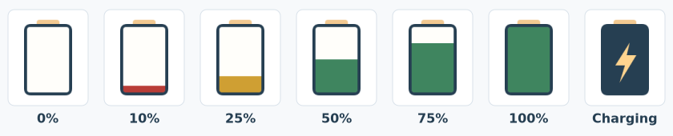

# Razer Tray Battery
### A simple Electron tray application for monitoring wireless Razer device battery levels

This repository is a personal branch/fork of the original
[`jozefwitek/RazerTrayBattery`](https://github.com/jozefwitek/RazerTrayBattery)
project. I am not the original author; this branch keeps the original idea and
adds changes for my own setup.

RazerTrayBattery is a lightweight application for monitoring the battery percentage of wireless Razer devices.
It works independently and does **not** require Razer Synapse to be installed or running.

This project is a **work in progress**, developed primarily for personal use.

### Changes in this branch

Compared with the original project, this branch adds:

* Direct battery percentage polling without relying on Razer Synapse logs or cached Synapse data
* Direct charging-state detection, with a dedicated tray icon while the device is charging
* Faster tray updates, including automatic refresh when switching between wireless and cable mode
* Hover text showing the current battery percentage and charging state
* A refreshed tray icon set with 0-100 battery fill levels, red/yellow/green battery states, and a charging icon
* A simple Windows installer build command through `npm run make:win`




### Supported Hardware
* Tested primarily with a Razer DeathAdder V3 Pro
* Other wireless Razer devices may work, but support is not guaranteed


### Compiling

Install dependencies:

```bash
npm install
```

Run the app locally:

```bash
npm start
```

Build the Windows installer:

```bash
npm run make:win
```

The installer will be created at `out/installer/RazerTrayBatterySetup.exe`.
